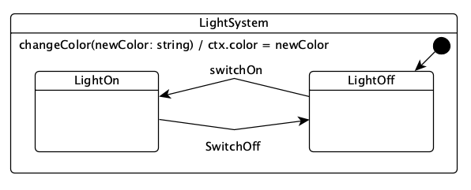

# ihsm

A hierarchical state machine implementation library for Typescript and Javascript.

It has been designed to _feel as natural_  as possible to any TS/JS developer. 

The _mechanics_ can be learned in 5 minutes. 

It's fully featured as it supports the full _UML state chart_ formalism, but it's so easy and natural to write that 
its actually faster to define a state machine by code than by using diagrams.

It supports:   
   * Events with payload
   * Extended states
   * Hierarchically nested states
   * Orthogonal states
   * Actions
   * Transitions
   * Guards
   * Entry/Exit actions
   * Initialization actions

  
## Install

To install _ihsm_ locally:

```shell 
npm install ihsm@latest
```

To install _ihsm_ globally:

```shell 
npm install -g ihsm@latest

```

## Few examples for the impatient ...

### Example 1: an untyped machine



The first simple will...
 - Implementing a state machine
 - Driving a state machine

### TopState machine implementation

What follows is a simple state machine implemented in Typescript using _ihsm_. 

```typescript
    import * as ihsm from 'ihsm';

    class LightMachine extends ihsm.TopState { 
        changeColor(newColor: string): void { this.ctx.color = newColor; } 
        _init(): void { this.ctx.color = 'white'}        
    }

    class LightOn extends LightMachine {
        switchOn(): void { this.logDebug('light is already on'); }
        switchOff(): void { this.transition(LightOff); } 
    }
    
    @ihsm.initialState
    class LightOff extends LightMachine {
        switchOn(): void { this.transition(LightOn); }
        switchOff(): void { this.logDebug('light is already off'); }    
    } 
```


an EventHandler is a method defined in a TopState class
an EventHandler is composed by:
   - an eventName: "changeColor"
   - an optional payload: (newColor: string)
   - a return type: void         

the _init() EventHandler is called when the state machine is created

_ihsm_ supports _nested states_; each state machine therefore shall have a _Top State_ which is
defined as the ancestor of all states. 

A _State_ is implemented as a TypeScript/Javascript class (ie. as Javascript constructor).
All states declare their parent by inheriting from its parent state.
A _Top State_ is defined as by inheriting directly by ```ihsm.TopState``` as follows:
```typescript
    import * as ihsm from "ihsm";
    // the Top TopState extends the library Top TopState
    class LightMachine extends ihsm.TopState {} 
```

Other states will declare it's parent state by _extending_ it as follows:
```typescript
    import * as ihsm from "ihsm";
    class LightMachine extends ihsm.TopState {}
    class LightOn extends LightMachine {}
```


This state machine can be drawn using the UML TopState chart formalism as:

_State Machine Image_


### Driving the state machine

```
function main() {
    let sm = ihsm.create(LightMachine, {});
    console.log(`state:${sm.currentState} color:${sm.ctx.color}`);
    sm.post('changeColor', 'red');
    sm.post('switchOn');
    console.log(`state:${sm.currentState} color:${sm.ctx.color}`);
    sm.post('switchOff');
    console.log(`state:${sm.currentState} color:${sm.ctx.color}`);
} 
```


```
Object | (LightMachine) initialize
Object |     (LightMachine) about to call #_init
Object |     (LightMachine) #_init called
Object |     (LightMachine) initial state is present and refers to (LightOff)
Object |     (LightOff) #_init - default empty implementation
Object |     (LightOff) is the new current state
Object | (LightOff) dispatch #changeColor["red"]
Object | (LightOff) dispatch #switchOn[]
Object |     (LightOff) transition to (LightOn) requested
Object |         (LightOff) _exit - default empty implementation
Object |         (LightOn) _entry - default empty implementation
Object |         (LightOn) is the new current state
Object | (LightOn) dispatch #switchOff[]
Object |     (LightOn) transition to (LightOff) requested
Object |         (LightOn) _exit - default empty implementation
Object |         (LightOff) _entry - default empty implementation
Object |         (LightOff) is the new current state
```

### Example 2: Add the Context type 

In the previous example the Typescript type system is not aware of the types involved in the implementation.

We are interested in having support for _code completion_ and _typechecking_ support. 
To add type 

```typescript 

import * as ihsm from 'ihsm';

class Light {
    color?: string;
}

class LightMachine extends ihsm.TopState<Light> {
    _init() { this.ctx.color = 'white'}
    changeColor(newColor: string) { this.ctx.color = newColor; }
}

class LightOn extends LightMachine {
    switchOn() { this.logDebug('light is already on'); }
    switchOff() { this.transition(LightOff); }
}

@ihsm.initialState
class LightOff extends LightMachine {
    switchOn() { this.transition(LightOn); }
    switchOff() { this.logDebug('light is already off'); }    
}

function main() {
    let sm = ihsm.create(LightMachine, new Light());
    console.log(`state:${sm.currentState} color:${sm.ctx.color}`);
    sm.post('changeColor', 'red');
    sm.post('switchOn');
    console.log(`state:${sm.currentState} color:${sm.ctx.color}`);
    sm.post('switchOff');
    console.log(`state:${sm.currentState} color:${sm.ctx.color}`);
}


```

### Example 3: Add the Protocol interface

```typescript 

import * as ihsm from 'ihsm';

class LightProtocol {
    changeColor(newColor: string): void;
    switchOn(): void;
    switchOff(): void;
}

class Light {
    color?: string;
}

class LightMachine extends ihsm.TopState<Light, Protocol> {
    _init() { this.ctx.color = 'white'}
    changeColor(newColor: string) { this.ctx.color = newColor; }
}

class LightOn extends LightMachine {
    switchOn() { this.logDebug('light is already on'); }
    switchOff() { this.transition(LightOff); }
}

@ihsm.initialState
class LightOff extends LightMachine {
    switchOn() { this.transition(LightOn); }
    switchOff() { this.logDebug('light is already off'); }    
}

function main() {
    let sm = ihsm.create(LightMachine, new Light());
    console.log(`state:${sm.currentState} color:${sm.ctx.color}`);
    sm.post('changeColor', 'red');
    sm.post('switchOn');
    console.log(`state:${sm.currentState} color:${sm.ctx.color}`);
    sm.post('switchOff');
    console.log(`state:${sm.currentState} color:${sm.ctx.color}`);
}


```

### As simple as possible with types 

* 

## Building reliable _reactive_ systems

A _reactive system_ is .... 


## Basic state machine concepts

If you are already familiar with the concept of _state machines_ you can skip this section.


## What's special about ihsm compared to other JS/TS state machines ?

_ihsm_ is a state machine library designed to be _idiomatic_ to TS/JS developers; it designed to be natural and easy to
use to a TypeScript/Javascript developer.
 
To understand the diffe 


Skip 
(Wiki)[] 
Many software systems are event-driven, which means that they continuously sleep for the occurrence of some external 
or internal event such as a mouse click, a button press, a time tick, or an arrival of a data packet. 
After recognizing the event, such systems react by performing the appropriate computation that may 
include manipulating the hardware or generating “soft” events that trigger other internal software components. 
That's why event-driven systems are alternatively called _reactive systems_. Once the event handling is complete, 
the system goes back to waiting for the next event.

The response to an event generally depends on both the type of the event and on the internal state of the system and can include a change of state leading to a state transition. The pattern of events, states, and state transitions among those states can be abstracted and represented as a finite-state machine (FSM).

The concept of a FSM is important in event-driven programming because it makes the event handling explicitly dependent on both the event-type and on the state of the system. When used correctly, a state machine can drastically cut down the number of execution paths through the code, simplify the conditions tested at each branching point, and simplify the switching between different modes of execution.[5] Conversely, using event-driven programming without an underlying FSM model can lead programmers to produce error prone, difficult to extend and excessively complex application code.[6] 


## On _hierarchical finite state machines_

## Tutorial

### A five min tutorial

### A 10 min min tutorial


# ihsm: The full user Guide

This section ...

The reference guide is provided here as a TSDoc generated document; the detailed _Reference guide_ is
defined in two symbols:
  - _IHSM_: which presents how to use an _hierarchical state machine_
  - _State_: which presents how to __implement__ a hierarchical state machine   

 

An _event handler_ is any public method defined in a TopState.

For instance the following state

```typescript

class MyData {
    someData: string;
    someOtherData: number;
}

interface MyProtocol {
    update(hsmId: string, value: number): void;
    computeValue(hsmId: string): string;
    sampleData(): Promise<string>;
}

class TopState<MyData, MyProtocol> {
    // ...
}

class MyState extends TopState<MyData, MyProtocol> {

    update(hsmId: string, value: number): void {
        // ...
    }

    computeValue(hsmId: string): string {
        let myOutputString;
        // ... compute the output string
        return myOutputString;
    }

    async sampleData(): Promise<string> {
        let sample;
        // ... compute the sampled data, maybe performing some kind
        // of asynchronous operation like reading the some input values
        // from a database or a REST API
        return sample;
    }

}
```
